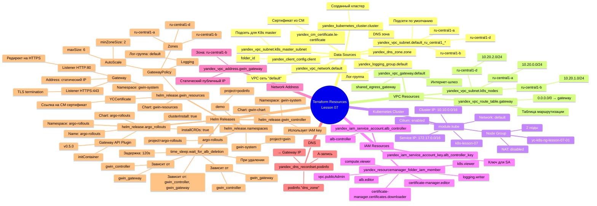
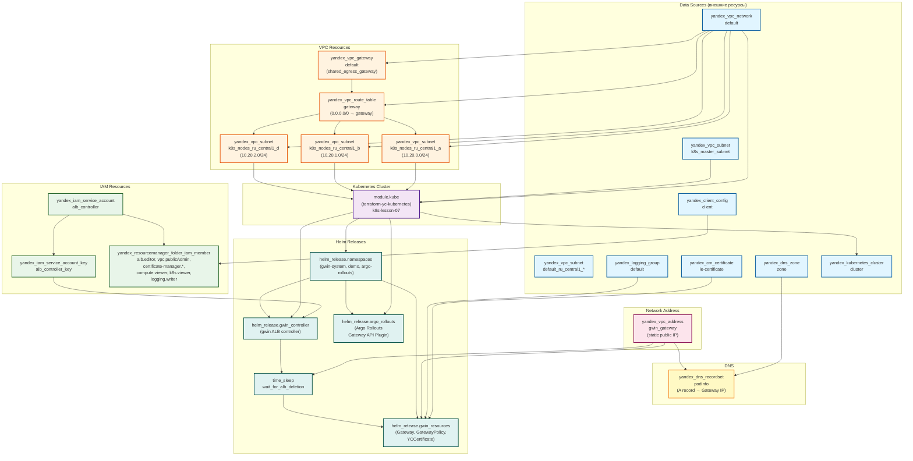

# Схема ресурсов Terraform для урока 07 (ALB Gwin)

## Mindmap схема ресурсов

## Диаграмма ресурсов (граф зависимостей)

## Описание ресурсов

### Data Sources (внешние ресурсы)

- **yandex_vpc_network.default** - существующая VPC сеть "default"
- **yandex_vpc_subnet.k8s_master_subnet** - существующая подсеть для Kubernetes master
- **yandex_vpc_subnet.default_ru_central1_*** - существующие подсети по умолчанию в трех зонах
- **yandex_dns_zone.zone** - существующая DNS зона
- **yandex_cm_certificate.le-certificate** - сертификат из Certificate Manager
- **yandex_logging_group.default** - лог-группа по умолчанию
- **yandex_client_config.client** - конфигурация клиента (folder_id)
- **yandex_kubernetes_cluster.cluster** - созданный Kubernetes кластер

### VPC Resources

- **yandex_vpc_gateway.default** - интернет-шлюз (shared egress gateway) для исходящего трафика
- **yandex_vpc_route_table.gateway** - таблица маршрутизации (0.0.0.0/0 → gateway)
- **yandex_vpc_subnet.k8s_nodes_ru_central1_*** - три подсети для Kubernetes nodes:
  - `ru-central1-a`: 10.20.0.0/24
  - `ru-central1-b`: 10.20.1.0/24
  - `ru-central1-d`: 10.20.2.0/24

### Kubernetes Cluster

- **module.kube** - модуль создания Kubernetes кластера:
  - Имя: `k8s-lesson-07`
  - Network: `default`
  - Cluster IP range: `10.10.0.0/16`
  - Service IP range: `172.17.0.0/16`
  - Cilium policy: включена
  - Node group: `yc-k8s-ng-lesson-07-01` (2 ноды, фиксированный размер)
  - NAT: отключен (используется gateway через route table)

### IAM Resources

- **yandex_iam_service_account.alb_controller** - сервисный аккаунт для ALB контроллера
- **yandex_iam_service_account_key.alb_controller_key** - ключ для сервисного аккаунта
- **yandex_resourcemanager_folder_iam_member** - роли для сервисного аккаунта:
  - `alb.editor` - создание ресурсов ALB
  - `vpc.publicAdmin` - управление сетевой связностью
  - `certificate-manager.certificates.downloader` - доступ к сертификатам
  - `certificate-manager.editor` - управление сертификатами
  - `compute.viewer` - просмотр узлов кластера
  - `k8s.viewer` - просмотр кластера
  - `logging.writer` - запись логов

### Network Address

- **yandex_vpc_address.gwin_gateway** - статический публичный IPv4 адрес для Gateway (зона: ru-central1-b)

### DNS

- **yandex_dns_recordset.podinfo** - A-запись `podinfo.{dns_zone}` → статический IP Gateway

### Helm Releases

1. **helm_release.namespaces** - создание namespace'ов:
   - `gwin-system` (project=gwin)
   - `demo` (project=podinfo)
   - `argo-rollouts` (project=argo-rollouts)

2. **helm_release.gwin_controller** - установка gwin ALB контроллера:
   - Chart: `gwin-chart`
   - Namespace: `gwin-system`
   - Использует ключ сервисного аккаунта для доступа к Yandex Cloud API

3. **helm_release.argo_rollouts** - установка Argo Rollouts:
   - Name: `argo-rollouts`
   - Chart: `argo-rollouts`
   - Namespace: `argo-rollouts`
   - CRDs: устанавливаются автоматически (`installCRDs: true`)
   - Cluster install: включен (`clusterInstall: true`)
   - Gateway API Plugin: установлен через initContainer (v0.5.0)

4. **helm_release.gwin_resources** - создание ресурсов Gateway:
   - Chart: `gwin-resources`
   - Namespace: `gwin-system`
   - Ресурсы:
     - `YCCertificate` - ссылка на сертификат из Certificate Manager
     - `Gateway` - настройка Application Load Balancer:
       - Listener HTTP (порт 80) - редирект на HTTPS
       - Listener HTTPS (порт 443) - терминация TLS
       - Address: статический IP из `yandex_vpc_address.gwin_gateway`
     - `GatewayPolicy` - политика для Gateway:
       - AutoScale: minZoneSize=2, maxSize=6
       - Logging: в лог-группу `default`
       - Zones: ru-central1-a, ru-central1-b, ru-central1-d

5. **time_sleep.wait_for_alb_deletion** - задержка при удалении (120 секунд) для корректного удаления ALB перед удалением Gateway:
   - Зависит от: `helm_release.gwin_controller`, `yandex_vpc_address.gwin_gateway`
   - Используется для обеспечения корректного порядка удаления ресурсов

## Порядок создания ресурсов

1. **Data Sources** - чтение существующих ресурсов
2. **VPC Resources** - создание gateway, route table, subnets
3. **Kubernetes Cluster** - создание кластера с использованием VPC ресурсов
4. **IAM Resources** - создание сервисного аккаунта и назначение ролей
5. **Network Address** - резервирование статического IP
6. **Helm: namespaces** - создание namespace'ов
7. **Helm: gwin_controller** - установка ALB контроллера
8. **Helm: argo_rollouts** - установка Argo Rollouts
9. **Helm: gwin_resources** - создание Gateway ресурсов (после задержки)
10. **DNS** - создание A-записи для podinfo

## Порядок удаления ресурсов

1. **DNS** - удаление A-записи
2. **Helm: gwin_resources** - удаление Gateway ресурсов
3. **Helm: wait_for_alb_deletion** - ожидание удаления ALB (120 секунд)
4. **Helm: gwin_controller** - удаление ALB контроллера
5. **Helm: argo_rollouts** - удаление Argo Rollouts
6. **Helm: namespaces** - удаление namespace'ов
7. **Network Address** - освобождение статического IP
8. **IAM Resources** - удаление ключа, ролей, сервисного аккаунта
9. **Kubernetes Cluster** - удаление кластера
10. **VPC Resources** - удаление subnets, route table, gateway

